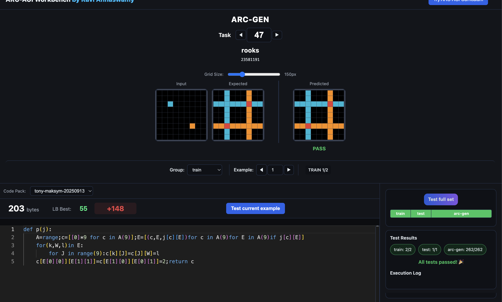

# ARC-AGI Workbench

A simple, yet useful browser-based development environment for solving and testing ARC (Abstraction and Reasoning Corpus) puzzles with Python. Features a modern interface with Monaco editor, real-time testing, and gamification elements.


## 📸 Screenshot


*ARC-AGI Workbench in Curriculum Mode showing the clean interface with grid visualizations, Monaco editor, and test results*

## 🚀 Features

### Core Functionality
- **Monaco Editor**: Full VS Code editing experience in the browser
- **Real-time Testing**: Instant feedback with PASS/FAIL indicators
- **Grid Visualization**: Interactive display of input, expected, and predicted outputs
- **Python Execution**: Browser-based Python runtime using Pyodide

### Advanced Features
- **🎓 Curriculum Mode**: Learn progressively from simpler to complex solutions
- **📦 Code Pack System**: Load and manage solution sets
- **🏆 Gamification**: Track your progress against leaderboard best scores
- **⚡ Fast Testing**: Stop-on-failure mode for efficient debugging

## 🎯 Quick Start

1. **Clone the repository**
```bash
git clone https://github.com/ravi-annaswamy/arc-workbench.git
cd arc-workbench
```

2. **Start a local server**
```bash
python -m http.server 8000
```

3. **Open in browser**
```
http://localhost:8000/
```

## 🌐 Static Hosting (GitHub Pages)

1. Push this repository to your GitHub account if you haven't already.
2. Open the repo settings ➜ *Pages* and set **Source** to `Deploy from a branch`, then pick `main` and `/ (root)`.
3. Save the settings—GitHub Pages will publish the static site at `https://<username>.github.io/<repo>/` in a minute or two.
4. Visit the published URL; the workbench and datasets load entirely from the static files in this repo.

## 📚 User Guide

### Writing Solutions

Solutions must implement a function `p(g)` that transforms input grids:

```python
def p(g):
    # g is a 2D list (grid) with values 0-9
    # Return transformed grid
    return transformed_grid
```

### Navigation Controls

- **Task Navigation**: Use ◀/▶ buttons or type task number directly
- **Example Selection**: Navigate through train/test/arc-gen examples
- **Grid Size**: Adjust visualization size with the slider

### Testing

- **Test Current Example**: Run your solution on the displayed example
- **Test Full Set**: Run all examples with progress tracking
- **Stop on Failure**: Tests halt at first failure for quick debugging

### Curriculum Mode

Click "Try ARC-AGI Curriculum" to:
- Sort tasks by solution complexity (code length)
- Progress from easier to harder problems
- Build understanding incrementally

## 🎨 Interface Overview

### Layout
- **Top Section**: Task browser with title, navigation, and grid display
- **Editor Panel**: Monaco editor with byte counter and test button
- **Test Panel**: Results summary, progress bar, and failure details

### Grid Colors
- 0: Black
- 1: Blue
- 2: Red
- 3: Green
- 4: Yellow
- 5: Gray
- 6: Pink
- 7: Orange
- 8: Cyan
- 9: Brown

## 📦 Code Packs

### ⚠️ Word of Caution
The tool runs locally on your machine and allows you to browse your submission file if you want. **If you place your submission files inside the codepacks folder, you need to make sure not to add them to any public repo.** The `code-packs/private/` folder is already gitignored for your protection, but always double-check before committing.

### Available Packs
- `tony-maksym-20250913.zip`: Recent submission archive

### Loading Code Packs
1. Select from dropdown in editor panel; you can place your submission zips in private folder and the latest one loads by default
2. Code auto-loads when navigating tasks
3. Solutions automatically run on example change

### Creating Code Packs
Create a ZIP file with Python files named `taskNNN.py`:
```
my-solutions.zip
├── task001.py
├── task002.py
└── ...
```

## 🏗️ Project Structure

```
arc-workbench/
├── index.html              # Main application
├── arc-gen-dataset/        # Task JSON files (400+ tasks)
│   ├── task001.json
│   ├── task002.json
│   └── ...
├── code-packs/             # Solution packages
│   ├── public/            # Public code packs
│   └── private/           # Private code packs (gitignored)
├── task-reference-data/    # Task metadata
│   └── arcgen_titles.json # Task names and hashes
└── leader-board/           # Performance tracking
    └── best-solution-bytes.json
```

## 🔧 Technical Details

### Dependencies (CDN)
- **Pyodide v0.24.1**: Python runtime in browser
- **Monaco Editor v0.45.0**: Code editing
- **JSZip v3.10.1**: ZIP file handling

### Browser Requirements
- Modern browser with JavaScript enabled
- WebAssembly support for Python execution
- Local file access for task loading

## 🤝 Contributing

Contributions are welcome! Please feel free to submit issues and pull requests.

### Development Setup
1. Fork the repository
2. Create a feature branch
3. Make your changes
4. Test thoroughly
5. Submit a pull request

## 📝 License

This project is licensed under the MIT License - see the LICENSE file for details.

## 🙏 Acknowledgments

- **@jazivxt** for creating an awesome starter and state-of-the-art public notebook that made entry easy for all
- **@moffitt** for awesome arc-gen generators
- **DeepMind team** for running this contest, because it makes ARC-AGI contest much easier to think about.
- **@chollet** for brilliant grasp of what was missing in LLMs
- many other contributors and researchers to ARC-AGI over the years.
- **Claude, Gemini, and GPT-5** for helping create this in about 5-6 hours
- Pyodide team for browser Python runtime
- Monaco Editor team for the excellent code editor

### About This Project

This workbench was created to keep track of my work and I wanted to share it so that it will both save time for lots of contestants and serve as a learning curriculum for ARC-AGI beyond the code golf contest. The tool aims to make ARC puzzle solving more accessible and enjoyable for everyone.

## 📊 Performance Tips

- Use the curriculum mode to learn progressively
- Watch the byte counter to optimize solution length
- Use stop-on-failure for faster debugging
- Test frequently with "Test current example"

## 🐛 Troubleshooting

### Common Issues

**Q: Code pack won't load**
- Ensure ZIP contains `.py` files named `taskNNN.py`
- Check browser console for errors

**Q: Python execution fails**
- Wait for Pyodide to fully load
- Check for syntax errors in your code
- Ensure function `p(g)` is defined

**Q: Grids not displaying**
- Verify task JSON files are present
- Check browser console for loading errors

## 📮 Contact

Created by [Ravi Annaswamy](https://github.com/ravi-annaswamy)

For issues and questions, please use the [GitHub Issues](https://github.com/ravi-annaswamy/arc-workbench/issues) page.

---

**Happy Puzzling! 🧩**
